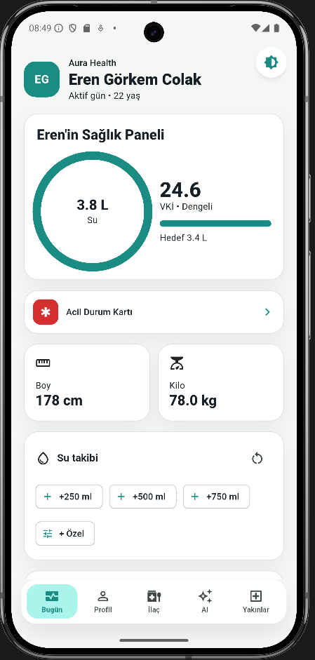
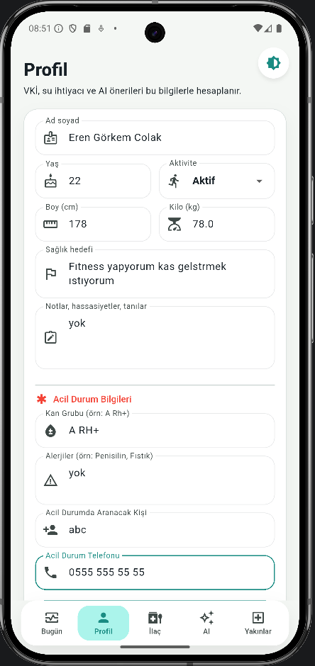
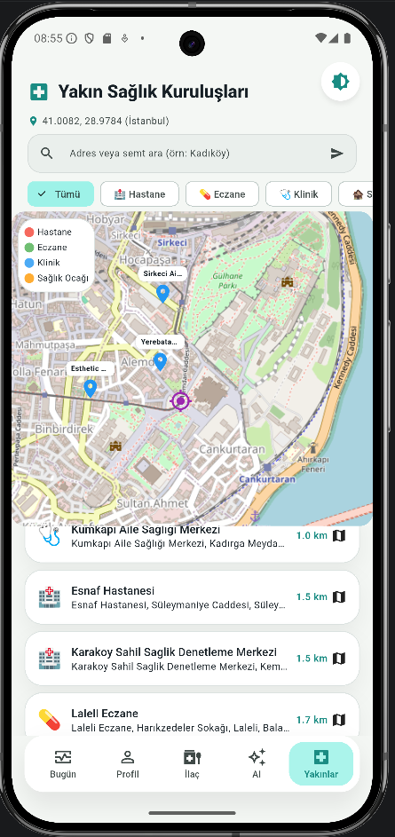

# 🧘 Aura Health — Kişisel Sağlık Asistanı

**Aura Health**, günlük sağlık takibini kolaylaştıran, yapay zeka destekli bir Flutter mobil uygulamasıdır. Su tüketimi, uyku, ilaç hatırlatmaları, BMI hesaplama ve AI koçluk özellikleriyle sağlığınızı tek bir yerden yönetmenizi sağlar.

<p align="center">
  
  
  
  
  
</p>

---

## ✨ Özellikler

### 🏠 Dashboard (Bugün)
- **Hero Sağlık Kartı** — Su ilerlemesi (dairesel gösterge), BMI değeri ve günlük su hedefi
- **Metrik Kartları** — Boy (cm) ve Kilo (kg) yan yana kartlar
- **Su Takibi** — +250 ml, +500 ml, +750 ml hızlı ekleme butonları ve özel miktar (100–1000 ml animasyonlu slider)
- **Su Zaman Çizelgesi** — Bugün içilen suların saatli listesi, tek tek silme
- **Uyku Takibi** — Yarım saatlik artışlarla uyku süresi ve 😴/😐/🤩 ruh hali
- **İlaç Kartları** — Aktif ilaçların bugün alınıp alınmadığını checkbox ile takip
- **Haftalık Su Grafiği** — `fl_chart` ile 7 günlük bar chart, hedef çizgisi ile
- **Aura İçgörü Kartı** — Sağlık hedefinize dair AI destekli kişisel öneri

### 💊 İlaç Yönetimi
- İlaç ekleme/düzenleme/silme (CRUD)
- Saat ve dakika seçici ile alarm kurma
- Yemek zamanı: Aç / Tok / Farketmez
- Günlük "alındı" işaretleme
- Aktif/Pasif toggle
- **Bildirim alarmı** — Tam ekran glassmorphism overlay, nefes animasyonu ile

### 🤖 AI Sağlık Koçu
- Yapay zeka destekli sohbet asistanı
- Sağlık profiline, ilaçlarına, su ve uyku verilerine özel yanıtlar
- Hızlı soru çipleri: "Bugünkü sağlık özetim", "Su tüketimim nasıl?", "Kilo kontrolü tavsiyesi"
- Sohbet geçmişi silinebilir

### 👤 Kullanıcı Sistemi
- **TC Kimlik No** + şifre ile kayıt ve giriş
- SHA-256 ile hash'lenmiş şifreler (SQLite)
- Kişisel sağlık profili: isim, yaş, boy, kilo, aktivite seviyesi, sağlık hedefi, özel notlar

### 🎨 Tema
- Material 3 açık/koyu tema desteği
- Sistem temasını takip etme veya manuel seçim
- Teal `#1A8C83` ve Coral `#E76F51` renk paleti

---

## 🧱 Teknoloji Yığını

| Katman | Teknoloji |
|--------|----------|
| **Framework** | Flutter 3.x (Dart) |
| **State Management** | `ChangeNotifier` + `InheritedNotifier` |
| **Veritabanı** | SQLite (`sqflite`) |
| **Yerel Depolama** | `shared_preferences` |
| **Bildirimler** | `flutter_local_notifications` |
| **Grafik** | `fl_chart` |
| **AI** | Yapay Zeka API (DeepSeek) |
| **Backend (opsiyonel)** | Node.js HTTP sunucu (`server.mjs`) |
| **Şifreleme** | SHA-256 (`crypto`) |

---

## 📁 Proje Yapısı

```
lib/
├── main.dart                    # Uygulama giriş noktası
└── src/
    ├── aura_app.dart            # Root widget, auth kontrolü, bottom nav shell
    ├── config/
    │   └── app_config.dart      # AI proxy URL ayarları
    ├── models/
    │   ├── chat_message.dart    # Sohbet mesaj modeli
    │   ├── health_profile.dart  # Sağlık profili, su/uyku logları
    │   ├── medication.dart      # İlaç modeli
    │   ├── sleep_log.dart       # Uyku kaydı modeli
    │   └── water_log.dart       # Su tüketim kaydı modeli
    ├── screens/
    │   ├── ai_coach_screen.dart  # AI sohbet ekranı
    │   ├── dashboard_screen.dart # Ana gösterge paneli
    │   ├── login_screen.dart     # Giriş ekranı
    │   ├── medication_screen.dart# İlaç yönetimi ekranı
    │   ├── profile_screen.dart   # Kullanıcı profili ve ayarlar
    │   └── register_screen.dart  # Kayıt ekranı
    ├── services/
    │   ├── ai_coach_service.dart  # Yapay zeka servisi
    │   ├── database_service.dart  # SQLite veritabanı servisi
    │   ├── health_calculator.dart # BMI, su hedefi hesaplamaları
    │   ├── notification_service.dart # İlaç alarm bildirimleri
    │   └── storage_service.dart   # SharedPreferences yönetimi
    ├── state/
    │   ├── aura_controller.dart   # Merkezi state yönetimi
    │   └── aura_scope.dart        # InheritedNotifier wrapper
    ├── theme/
    │   └── aura_theme.dart        # Light/Dark tema tanımları
    └── widgets/
        ├── aura_card.dart         # Özelleştirilmiş kart widget'ı
        └── medication_alarm_overlay.dart # İlaç alarmı overlay
```

---

## 🚀 Başlangıç

### Gereksinimler

- Flutter SDK 3.x+
- Dart SDK 3.x+
- Android Studio / Xcode
- Node.js 18+ (backend için opsiyonel)

### Kurulum

```bash
# Repoyu klonla
git clone https://github.com/gorkemcolakk/Aura-Health-Personal-Assistant.git
cd Aura-Health-Personal-Assistant

# Bağımlılıkları yükle
flutter pub get

# Uygulamayı çalıştır
flutter run
```

### Backend (Opsiyonel)

AI özellikleri için backend proxy kullanabilirsin:

```bash
cd backend
cp .env.example .env.local
# .env.local dosyasına API anahtarını ekle
node server.mjs
```

Proxy `http://127.0.0.1:8787` adresinde çalışır.

---

## 🔐 Güvenlik

- Kullanıcı şifreleri **SHA-256** ile hash'lenerek SQLite'da saklanır
- TC Kimlik No, kullanıcı kimliklendirme anahtarı olarak kullanılır

---

## 📬 İletişim

| | |
|---|---|
| 📍 | İstanbul, Türkiye |
| 📧 | [grkeemcolak@icloud.com](mailto:grkeemcolak@icloud.com) |
| 🔗 | [linkedin.com/in/eren-gorkem-colak](https://linkedin.com/in/eren-gorkem-colak) |

---

<p align="center">
  <i>Sağlığın, senin kontrolünde. 🧘‍♂️</i>
</p>

